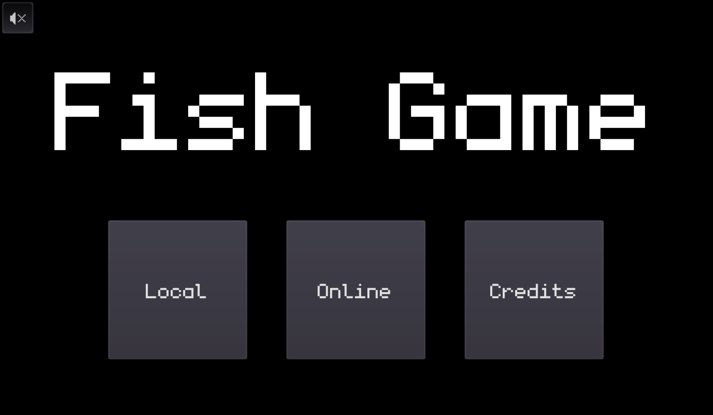

# 
A [website](https://gamecom.io) made by [Christian Deacon](https://github.com/gamemann) that helps users find any game, community, mod, or server. All data retrieved by [@modcommunity](https://github.com/modcommunity).

This website is open-source and this is its source code respository! Help support [The Modding Community](https://ModdingCommunity.com) by spreading the word!

## Showcase

## Games
### [Fish Game](https://gamecom.io/fishgame)

An [open-source](https://github.com/heroiclabs/fishgame-godot) combat game made with [Godot](http://godotengine.org/)! The game's developers have also made an open-source game server [here](https://heroiclabs.com/)! [Gamecom.io](https://gamecom.io/) hosts an instance of this server with our version of the game.

Join in, invite a friend, and have fun! We will be doing a lot with this between Gamecom and [@modcommunity](https://github.com/modcommunity) along with many other future games to come!

Use **W**, **S**, **A**, **D** to move. Use **E** to pick up weapons and **Q** to attack.

# Credits
* [Christian Deacon](https://github.com/gamemann)